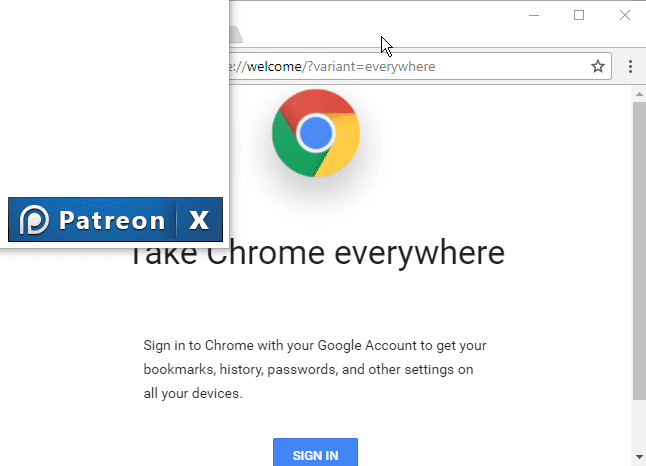
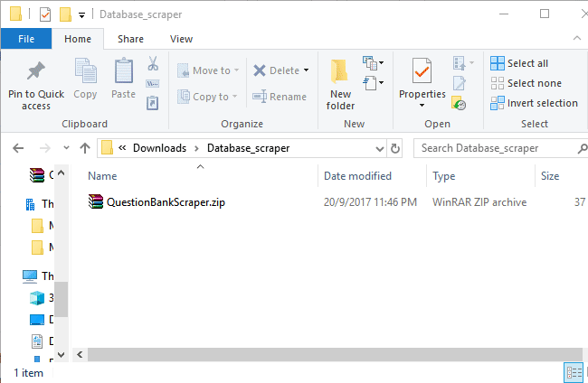
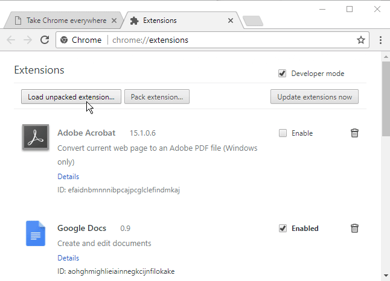
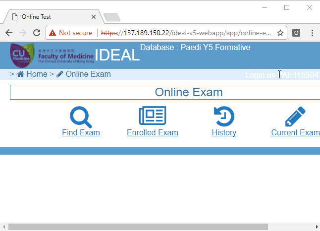

# Question Bank Scraper

Hi! This is a small project to collect as many questions from the official formative assessment bank. It should work seamlessly with as little user interaction as possible. You can also benefit from the project by viewing the questions and answers collected on the [discussion forum](https://doplgangr.github.io/databasescraper/question.html).

As of now, we need your kind input to make this happen. We need _your help_ to collect as many questions as possible.

## How do I contribute?
You can contribute by simply installing a chrome browser extension. Just follow the instructions below!

**Step 1: turn on developer mode**

**Step 2: Download the extension**

Please click on this [LINK](QuestionBankScraper.zip) to download

**Step 3: unzip/extract the file**

**Step 4: load it up in chrome**

**Step 5: just attempt the FA**

**Step 6: Open the questions and answers in history mode**

**DONE!**
The questions and answers opened will be saved automatically in the database we have. You can view the most updated list [here](question.html).
